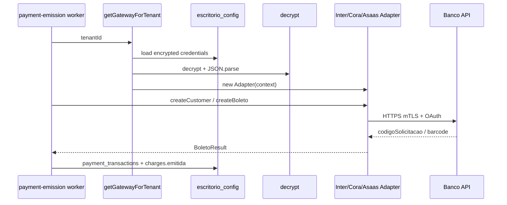

# Pacote de demandas — Sprint L: Gateway universal (fase 1 — Inter + Cora)

**Emitido por:** Tech Lead · PO · Arquiteto · Analista  
**Para:** Fábrica (IA + dev)  
**Data:** Maio 2026 · **Base:** `main` (pós Sprint I/J, Playwright, n8n homolog)  
**Prioridade:** P1 · **Estimativa:** 10–14 dias · **Branch:** `feat/sprint-l-universal-gateway`  
**Fonte de pesquisa (não executar direto):** [ESTUDO_APIS_BANCARIAS.md](./ESTUDO_APIS_BANCARIAS.md)  
**Arquitetura alvo:** [LLD_REVISADO_v2.md](./LLD_REVISADO_v2.md) (seções 2.x — registry + factory)

---

## Gate de entrada

```bash
git fetch origin && git checkout main && git pull origin main
git checkout -b feat/sprint-l-universal-gateway
npm ci && npm run migrate && npm run seed:dev
npm run build && npm test && npm run portal:test
npm run quality:gate
```

**Governança:** [GOVERNANCA_FABRICA_COMMIT_PR.md](./GOVERNANCA_FABRICA_COMMIT_PR.md) — IA faz commit + PR + handoff; **Tech Lead** faz merge.

**Pré-requisitos:** Sprint 1 emissão Asaas estável (`payment-emission-processor`, `AsaasAdapter`), portal `/configuracoes` com gateway, `ENCRYPTION_KEY` no `.env`.

---

## Contexto — o que já existe vs o que o estudo assume

| Item | Estado real no repo (verificar antes de codar) | Nota |
|------|-----------------------------------------------|------|
| `PaymentGatewayAdapter` | **Existe** em `src/modules/payment-gateway/domain/payment-gateway.interface.ts` | Métodos: `createCustomer`, `createBoleto`, `createPix`, `cancelCharge`, `getCharge` — **não** `emitCharge()` único |
| `AsaasAdapter` | **Existe** em `src/modules/payment-gateway/infrastructure/asaas/` | Único adapter implementado |
| `getGatewayForTenant()` | **Não existe** (só em LLD/kickoff) | Worker usa `defaultCreateAdapter(apiKey)` + `new AsaasAdapter` |
| `runEmission` | **Existe** em `payment-emission-processor.ts` | Bloqueia `gateway_provider !== 'asaas'` (linha ~213) |
| Credenciais | `escritorio_config.gateway_api_key_encrypted` + `encryption_iv` | Criptografia: `encryptAes256Gcm` / `decrypt` |
| `gateway_provider` CHECK | Apenas `asaas`, `pagarme` (migration 013) | Pagarme **sem** adapter — não expandir Pagarme neste sprint |
| `GATEWAY_REGISTRY` | **Não existe** | Criar neste sprint |
| `buildMtlsAgent` / `token-cache` | **Não existem** | Criar neste sprint |

**Regra para a fábrica:** não copiar skeletons do `ESTUDO_APIS_BANCARIAS.md` que referenciam `emitCharge` como contrato único. Implementar adapters que **implementam a interface atual** e mapeiam payload bancário dentro do adapter.

---

## Objetivo Sprint L (PO)

Permitir que um tenant configure **Banco Inter** ou **Cora** no portal, persista credenciais criptografadas (JSON), e que o worker de emissão (`charges-emission`) emita boleto em **sandbox** usando o adapter correto — **sem** quebrar Asaas.

**Fora de escopo Sprint L:** BB, C6 Bank (Sprint M), Pagarme adapter, UI dinâmica completa no portal (mínimo: API schema + PATCH credenciais JSON), estorno `estornada`, faturamento dia 25, troca de gateway com audit log (Sprint M).

---

## L.0 — Tipos e contratos (criar antes dos adapters)

### L.0.1 — Tipos de domínio (novo arquivo)

**Criar:** `src/modules/payment-gateway/domain/gateway-types.ts`

```typescript
/** Credenciais descriptografadas — shape do JSON em escritorio_config (ver migration 025). */
export type GatewayCredentials = Record<string, string>;

/** Contexto passado ao construir qualquer adapter. */
export type GatewayAdapterContext = {
  tenantId: string;
  provider: string;
  credentials: GatewayCredentials;
  sandbox: boolean;
};

/** Entrada de emissão agregada (uso interno factory/worker — NÃO substitui CreateBoletoInput). */
export type ChargeEmissionContext = {
  chargeId: string;
  tenantId: string;
  reference: string;
  idempotencyKey: string;
  amount: number;
  dueDate: string; // YYYY-MM-DD
  type: "boleto" | "pix";
  cliente: {
    id: string;
    documento: string;
    nome: string;
    email: string | null;
    telefone: string | null;
    gatewayCustomerId: string | null;
    endereco?: CreateCustomerInput["endereco"];
  };
};

/** Resultado normalizado pós-emissão (mapeia para BoletoResult | PixResult). */
export type GatewayEmissionResult = {
  gatewayTransactionId: string;
  boleto?: import("./payment-gateway.interface").BoletoResult;
  pix?: import("./payment-gateway.interface").PixResult;
  providerRaw?: Record<string, unknown>;
};
```

### L.0.2 — Estender interface existente (evolução mínima)

**Modificar:** `src/modules/payment-gateway/domain/payment-gateway.interface.ts`

- Adicionar `endereco?` em `CreateCustomerInput` (BB/Inter — ver LLD §2.3).
- Adicionar campos opcionais em `CreateBoletoInput` se necessário para Inter (`pagador` mapeado no adapter, não na interface global).
- **Opcional neste PR:** `estornarCobranca?` — deixar para Sprint N; não bloquear L.

**Não remover** `createCustomer` / `createBoleto` / `createPix`.

### L.0.3 — Erros de gateway

**Criar ou estender:** `src/modules/payment-gateway/domain/payment-gateway-error.ts`

- `GatewayNotConfiguredError`, `GatewayCredentialsMissingError`, `UnsupportedGatewayProviderError`, `GatewayAuthError`, `GatewayProviderError` (com `provider`, `statusCode?`, `providerBody?`).

---

## L.1 — Infraestrutura compartilhada (platform)

| Arquivo | Ação |
|---------|------|
| `src/platform/payment-gateway/mtls-agent.ts` | **Criar** — `buildMtlsAgent({ certPem, keyPem }): https.Agent` (cert/key só em memória) |
| `src/platform/payment-gateway/oauth-token-cache.ts` | **Criar** — Redis `gw_token:{provider}:{tenantId}`, TTL = `expires_in - 60` |
| `src/platform/payment-gateway/provider-registry.ts` | **Criar** — `GATEWAY_REGISTRY`, `getProviderMeta`, `listAvailableProviders` (Inter, Cora, Asaas; BB/C6 **metadata only** `enabled: false` se quiser UI futura) |
| `src/platform/payment-gateway/credential-schema.ts` | **Criar** — valida JSON de credenciais contra `credentialFields` do registry |

**Referência de payloads/URLs:** [ESTUDO_APIS_BANCARIAS.md](./ESTUDO_APIS_BANCARIAS.md) §2 (Inter), §3 (Cora).

**Testes:**

- `tests/platform/payment-gateway/mtls-agent.test.ts` — agent monta com PEM de fixture (sem rede).
- `tests/platform/payment-gateway/oauth-token-cache.test.ts` — mock Redis.
- `tests/platform/payment-gateway/provider-registry.test.ts` — Inter/Cora têm campos obrigatórios.

---

## L.2 — Factory (ponto único de criação de adapter)

**Criar:** `src/modules/payment-gateway/application/get-gateway-for-tenant.ts`

```typescript
export async function getGatewayForTenant(
  client: PoolClient,
  tenantId: string,
  deps?: { decrypt?: typeof decrypt; sandbox?: boolean }
): Promise<PaymentGatewayAdapter>;
```

**Fluxo obrigatório (cola com o código atual):**

1. `SELECT gateway_provider, gateway_credentials_encrypted, encryption_iv, gateway_api_key_encrypted FROM escritorio_config WHERE tenant_id = $1` (suporte legado Asaas — ver L.3).
2. Se `gateway_credentials_encrypted` preenchido → `decrypt` + `JSON.parse` → `GatewayCredentials`.
3. Senão, se `gateway_api_key_encrypted` (legado Asaas) → `{ api_key: decrypt(...) }`.
4. `getProviderMeta(provider)` — falha se provider desconhecido.
5. `ADAPTER_LOADERS[provider]()` — import dinâmico:

| Provider | Loader → classe |
|----------|-----------------|
| `asaas` | `../infrastructure/asaas/asaas-adapter` (refatorar construtor para aceitar `GatewayAdapterContext`) |
| `inter` | `../infrastructure/inter/inter-adapter` |
| `cora` | `../infrastructure/cora/cora-adapter` |

6. Retornar instância `PaymentGatewayAdapter`.

**Regra:** Nenhum arquivo fora do factory faz `new AsaasAdapter(...)` (exceto testes unitários do próprio adapter).

**Testes:** `tests/modules/payment-gateway/get-gateway-for-tenant.test.ts` — mock DB row + mock loader; Asaas legado; Inter com JSON credentials.

---

## L.3 — Migration SQL `025_gateway_credentials_universal.sql`

**Criar:** `db/migrations/025_gateway_credentials_universal.sql`

| Alteração | Detalhe |
|-----------|---------|
| `escritorio_config.gateway_credentials_encrypted` | `TEXT NULL` — JSON cifrado (substitui uso exclusivo de api_key para bancos novos) |
| `CHECK gateway_provider` | Incluir `inter`, `cora` (manter `asaas`; `pagarme` opcional até adapter existir) |
| `payment_transactions.gateway` CHECK | Incluir `inter`, `cora` |
| Comentário SQL | Documentar: Asaas pode continuar em `gateway_api_key_encrypted` até script de migração de dados |

**Script opcional (dev):** `scripts/migrate-asaas-key-to-credentials-json.ts` — copia api_key legada para `{ "api_key": "..." }` em `gateway_credentials_encrypted` (não rodar em prod automaticamente).

---

## L.4 — Adapters Inter e Cora

### Estrutura de pastas (padrão do projeto)

```
src/modules/payment-gateway/infrastructure/
  asaas/          ← existente (ajustar construtor)
  inter/
    inter-adapter.ts
    inter-http-client.ts
    inter-oauth.ts
    inter-types.ts
    inter-status-map.ts
  cora/
    cora-adapter.ts
    cora-http-client.ts
    cora-oauth.ts
    cora-types.ts
```

### Inter adapter — comportamento

| Método interface | Implementação |
|------------------|---------------|
| `createCustomer` | Se Inter não exige customer separado: retornar `externalReference` ou ID sintético documentado no adapter |
| `createBoleto` | `POST /cobrancas/v2` — mTLS + Bearer (cache OAuth) — mapear `CreateBoletoInput` → payload §2.2 ESTUDO |
| `createPix` | `UnrecoverableError` ou `GatewayProviderError('not_supported')` se sandbox não tiver PIX |
| `cancelCharge` | `POST` cancelamento §2.4 ESTUDO |
| `getCharge` | `GET /cobrancas/v2/{codigoSolicitacao}` — mapear situação → status interno |

**Persistir em `charges.provider_charge_id`:** `codigoSolicitacao` (UUID Inter).

**Polling:** se resposta `EM_PROCESSAMENTO`, adapter pode fazer 1–3 retries com delay (configurável) antes de devolver `BoletoResult`.

### Cora adapter — comportamento

Seguir [ESTUDO_APIS_BANCARIAS.md](./ESTUDO_APIS_BANCARIAS.md) §3 (mTLS + OAuth + endpoints de invoice/boleto).

---

## L.5 — Conectar worker `runEmission` (crítico)

**Modificar:** `src/platform/jobs/application/payment-emission-processor.ts`

| Antes | Depois |
|-------|--------|
| `loadEscritorioConfig` só api_key | Carregar também `gateway_credentials_encrypted` |
| `if (provider !== 'asaas') throw` | Remover bloqueio |
| `defaultCreateAdapter(apiKey)` | `const adapter = await getGatewayForTenant(client, data.tenantId, { sandbox: !isProduction() })` |

**Manter** fluxo: `createCustomer` → `createBoleto`/`createPix` → `insertPaymentTransaction` → `canonical_status = emitida` → `insertChargeEvent` → `emitN8nPlatformEvent('charge.emitted')`.

**Modificar:** `src/platform/jobs/application/charge-sync-reconciliation.ts` — usar `getGatewayForTenant` em vez de `AsaasAdapter` direto (mesmo padrão).

**Testes:** estender `tests/platform/jobs/payment-emission-n8n.test.ts` e criar `payment-emission-inter.test.ts` com adapter mock injetado via `deps.createAdapter` **ou** mock factory.

---

## L.6 — Portal / API (mínimo para homolog)

**Modificar:** `src/modules/portal-read/application/escritorio-config-use-cases.ts`

- `gateway_provider` enum: `asaas | inter | cora` (pagarme só se já usado em UI).
- PATCH aceita `gateway_credentials: Record<string, string>` → valida com `credential-schema` → `encryptAes256Gcm(JSON.stringify)` → grava em `gateway_credentials_encrypted`.

**Criar rotas (se não existirem):**

| Método | Caminho | Função |
|--------|---------|--------|
| GET | `/v1/portal/escritorio/gateway/providers` | `listAvailableProviders()` |
| GET | `/v1/portal/escritorio/gateway/providers/:provider/schema` | `credentialFields` do registry |

**Frontend:** fora do escopo obrigatório do PR — pode ser só API + Postman; opcional: select provider em `/configuracoes` se couber < 100 linhas.

---

## L.7 — Testes e critérios de aceite por banco

### Matriz “sprint done”

| Provider | Teste unitário adapter | Teste factory | Sandbox E2E (opt-in) | Regressão |
|----------|------------------------|---------------|----------------------|-----------|
| **Asaas** | existente verde | load legado api_key | `RUN_ASAAS_E2E=1` (já existe) | `npm test` sem quebra |
| **Inter** | `inter-adapter.test.ts` mock HTTP + mTLS mock | provider `inter` | `RUN_INTER_SANDBOX=1` script novo | emissão job mock |
| **Cora** | `cora-adapter.test.ts` mock HTTP | provider `cora` | `RUN_CORA_SANDBOX=1` script novo | idem |

### Comandos DoD

```bash
npm run build
npm test
npm run portal:test
npm run quality:gate
```

### Critérios de aceite (PO)

- [ ] Tenant com `gateway_provider=inter` e credenciais sandbox salvas no portal/API consegue emitir cobrança `rascunho` → `emitida` via worker.
- [ ] Tenant Asaas existente continua emitindo sem alterar `.env` de produção.
- [ ] Credenciais nunca aparecem em log/audit em claro.
- [ ] Certificados mTLS nunca escritos em disco pelo processo Node.
- [ ] [ESTUDO_APIS_BANCARIAS.md](./ESTUDO_APIS_BANCARIAS.md) referenciado no PR como fonte de mapeamento HTTP, não como spec de arquivos.

---

## L.8 — Scripts de homolog (dev)

| Script | Uso |
|--------|-----|
| `scripts/gateway-smoke-inter-sandbox.ts` | Emite 1 boleto Inter sandbox (requer credenciais reais env) |
| `scripts/gateway-smoke-cora-sandbox.ts` | Idem Cora |
| `npm run gateway:smoke:inter` | package.json |
| `npm run gateway:smoke:cora` | package.json |

Variáveis: `DATABASE_URL`, `ENCRYPTION_KEY`, credenciais no `escritorio_config` do tenant demo.

---

## L.9 — Documentação

| Arquivo | Ação |
|---------|------|
| [docs/GATEWAY_UNIVERSAL.md](../docs/GATEWAY_UNIVERSAL.md) | **Criar** — arquitetura factory + diagrama emissão |
| [ESTUDO_APIS_BANCARIAS.md](./ESTUDO_APIS_BANCARIAS.md) | Adicionar nota no topo: “pesquisa — implementação em DEMANDA_SPRINT_L” |
| [LLD_REVISADO_v2.md](./LLD_REVISADO_v2.md) | Sem alteração obrigatória |
| `.env.example` | Comentar vars sandbox Inter/Cora se aplicável |

---

## L.10 — PR + handoff

- **Título:** `feat(gateway): universal factory + Inter/Cora adapters (Sprint L)`
- **Corpo:** Summary + diagrama + Test plan + link este arquivo
- **Secrets:** nunca commitar PEM, client_secret, `.env`

---

## Mapa de dependências (Arquiteto)



---

## Perguntas para o PO (bloquear se ausente)

1. Credenciais sandbox **Inter** e **Cora** — PO/Tech Lead fornecem PEM + client_id para CI/homolog ou só testes mock neste sprint?
2. Portal UI dinâmica no L ou só API + Postman?
3. Prioridade: Cora antes de Inter ou ambos obrigatórios no mesmo PR?

**Defaults se silêncio:** mock + sandbox manual; API only; ambos no mesmo PR com feature flag `GATEWAY_INTER_ENABLED` / `GATEWAY_CORA_ENABLED` em dev.

---

## Sprint M (não implementar agora)

- `bb.adapter.ts`, `c6bank.adapter.ts`
- `gateway_change_log`, PATCH troca gateway
- Portal formulário dinâmico completo
- Ver [ESTUDO_APIS_BANCARIAS.md](./ESTUDO_APIS_BANCARIAS.md) §10

---

## Referências código (pontos de ancoragem)

| Responsabilidade | Caminho atual |
|------------------|---------------|
| Worker emissão | `src/platform/jobs/application/payment-emission-processor.ts` → `runEmission`, `processPaymentEmission` |
| Adapter Asaas | `src/modules/payment-gateway/infrastructure/asaas/asaas-adapter.ts` |
| Interface | `src/modules/payment-gateway/domain/payment-gateway.interface.ts` |
| Criptografia | `src/platform/crypto/symmetric-encryption.ts`, `decrypt.ts` |
| Config escritório | `db/migrations/013_desacoplamento_nfse.sql` (`escritorio_config`) |
| Portal config Zod | `src/modules/portal-read/application/escritorio-config-use-cases.ts` |

---

*Documento executável pela fábrica. Dúvidas de payload HTTP → ESTUDO; dúvidas de arquivo e fluxo → este documento.*
