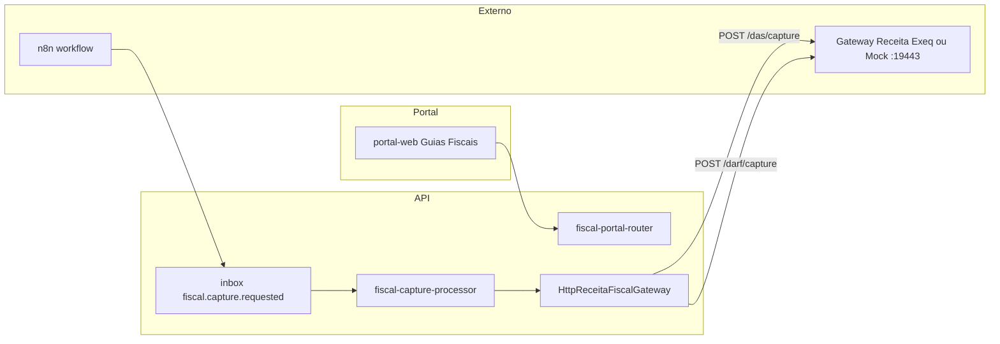
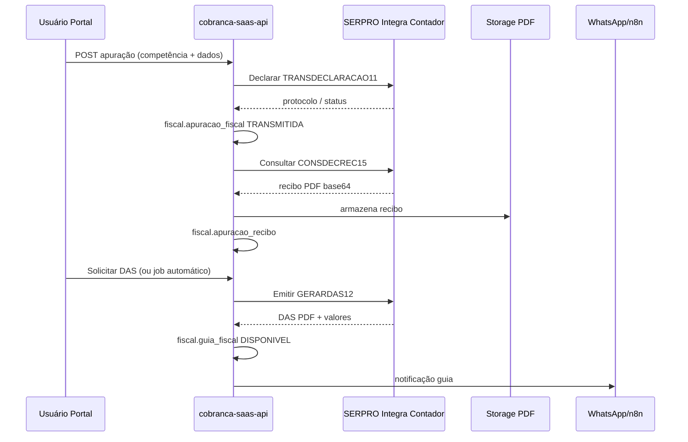

# Análise de integração — SERPRO Integra Contador (apuração, recibo, DAS e DARF)

**Data:** 2026-06-06  
**Papel:** Analista / Arquiteto de software / DBA / Engenheiro de sistemas  
**Projeto:** `cobranca-saas-api` (Exeq — Cobrança SaaS + Módulo Fiscal Guias)  
**Referência externa:** [Integra Contador — SERPRO](https://apicenter.estaleiro.serpro.gov.br/documentacao/api-integra-contador/)

---

## 1. Escopo e nomenclatura

### 1.1 Sobre “CEPRO”

No repositório **não há referência a “CEPRO”**. Com base no pedido (envio de apuração, recibo de apuração, emissão de DAS e DARF), a integração alvo é quase certamente:

| Termo citado | Interpretação provável | Evidência |
|--------------|------------------------|-----------|
| **CEPRO** | **SERPRO** (typo / transcrição de voz) | API oficial Receita via Loja SERPRO |
| Alternativa secundária | **EPROCESSO** (`idSistema: EPROCESSO`) | Catálogo SERPRO — consulta de processos administrativos, **não** apuração/DAS/DARF |

**Recomendação ao PO:** confirmar formalmente se o alvo é **SERPRO Integra Contador**. Este documento assume **SIM**.

### 1.2 Objetivo funcional

Integrar o fluxo contábil completo:

1. **Envio de apuração** (declaração mensal PGDASD / DCTFWeb conforme regime)
2. **Obtenção do recibo** de entrega da apuração
3. **Emissão de DAS** (Simples Nacional)
4. **Emissão de DARF** (SICALC / DCTFWeb)

---

## 2. Estado atual no projeto

### 2.1 Visão arquitetural (AS-IS)



**Conclusão:** o sistema implementa **captura/emissão de guia** (PDF + linha digitável + PIX) via **gateway intermediário próprio**, não via contrato SERPRO Integra Contador.

### 2.2 Módulos e artefatos relevantes

| Camada | Local | Função |
|--------|-------|--------|
| Domínio | `src/modules/fiscal-guias/domain/receita-gateway.interface.ts` | Contrato `ReceitaFiscalGateway` (DAS/DARF capture) |
| Infra | `http-receita-fiscal-gateway.ts` | HTTP → `{RECEITA_DAS_CAPTURE_URL}/das|darf/capture` |
| Worker | `fiscal-capture-processor.ts` | BullMQ: cert A1, gateway, PDF S3, `fiscal.guia_fiscal` |
| Inbox | `handle-fiscal-capture-inbox.ts` | Evento `fiscal.capture.requested` |
| Portal | `GuiasFiscaisPage`, `GuiaFiscalDetalhePage`, `ConfigFiscalPage` | Listagem, detalhe, certificado/procuração |
| DB | `db/migrations/028_fiscal_guias_fase0.sql` | Schema `fiscal.*` (certificado, procuração, guia, pagamento) |
| Mock | `scripts/receita-das-mock-gateway.ts` | Homolog local sem OpenSSL/SERPRO |
| Docs | `ADR_FISCAL_GUIAS_FASE0.md`, `FISCAL_HOMOLOG_E2E.md` | Fase 0–2 guias; homolog pendente gateway real |

### 2.3 O que **já existe**

- Certificado digital A1 por cliente (`fiscal.certificado_digital`, cifrado AES)
- Cadastro de procuração **local** (`fiscal.procuracao`) — **sem** validação SERPRO `PROCURACOES/OBTERPROCURACAO41`
- Entidade `fiscal.guia_fiscal` com status, competência, valores, PDF, compliance
- Fluxo assíncrono n8n → inbox → worker → notificação WhatsApp (template guia disponível)
- Feature flag `FISCAL_GUIAS_ENABLED` e stub `FISCAL_CAPTURE_STUB`
- Reconciliação de pagamento (inbox `fiscal.guia.reconciliation`)

### 2.4 O que **não existe** (gap vs SERPRO)

| Capacidade SERPRO | Status no projeto |
|-------------------|-------------------|
| Autenticação Loja SERPRO (OAuth2 / credenciais contratante) | ❌ |
| Corpo padrão `contratante / autorPedidoDados / contribuinte / pedidoDados` | ❌ |
| `PGDASD/TRANSDECLARACAO11` — entregar apuração | ❌ |
| `PGDASD/CONSDECREC15` ou `CONSULTIMADECREC14` — recibo apuração | ❌ |
| `PGDASD/GERARDAS12` — emitir DAS via SERPRO | ❌ (usa gateway custom `/das/capture`) |
| `SICALC/CONSOLIDARGERARDARF51` — emitir DARF PDF | ❌ (usa gateway custom `/darf/capture`) |
| `AUTENTICAPROCURADOR/ENVIOXMLASSINADO81` — token procurador | ❌ |
| Persistência de **apuração/declaração** (competência, protocolo, recibo PDF) | ❌ |
| Portal: tela de apuração / transmissão / histórico recibos | ❌ |

---

## 3. Estudo SERPRO Integra Contador — endpoints alvo

**Base:** Loja de APIs SERPRO — caminhos por **tipo** (`Apoiar`, `Consultar`, `Declarar`, `Emitir`, `Monitorar`).  
**Método:** sempre `POST`, body JSON, campo `dados` como **string JSON escapada**.

Documentação: [Integra Contador — padrões](https://apicenter.estaleiro.serpro.gov.br/documentacao/api-integra-contador/pt/integra_contador/)  
Catálogo: [Catálogo de Serviços](https://apicenter.estaleiro.serpro.gov.br/documentacao/api-integra-contador/pt/catalogo_de_servicos/)

### 3.1 Simples Nacional (PGDASD) — fluxo principal DAS

| Seq | idSistema | idServico | Tipo | Descrição | Uso Exeq |
|-----|-----------|-----------|------|-----------|----------|
| 1.1 | `PGDASD` | `TRANSDECLARACAO11` | Declarar | Entregar declaração mensal | **Envio de apuração** |
| 1.4 | `PGDASD` | `CONSULTIMADECREC14` | Consultar | Última declaração/recibo transmitida | **Recibo mais recente** |
| 1.5 | `PGDASD` | `CONSDECREC15` | Consultar | Declaração/recibo específicos | **Recibo por PA/competência** |
| 1.2 | `PGDASD` | `GERARDAS12` | Emitir | Gerar DAS (PDF) | **Emissão DAS pós-apuração** |
| 1.3 | `PGDASD` | `CONSDECLARACAO13` | Consultar | Declarações transmitidas | Listagem/histórico |
| 1.9 | `PGDASD` | `GERARDASAVULSO19` | Emitir | DAS avulso p/ PA transmitido | Cenário retificação/avulso |

**Ordem lógica de negócio:**

```text
TRANSDECLARACAO11 (apuração)
    → CONSDECREC15 / CONSULTIMADECREC14 (recibo PDF)
    → GERARDAS12 (guia de pagamento)
    → (opcional) CONSEXTRATO16 (extrato DAS)
```

### 3.2 DARF — SICALC

| Seq | idSistema | idServico | Tipo | Descrição | Uso Exeq |
|-----|-----------|-----------|------|-----------|----------|
| 5.1 | `SICALC` | `CONSOLIDARGERARDARF51` | Emitir | Consolidar e emitir DARF PDF | **Emissão DARF** |
| 5.4 | `SICALC` | `CONSOLIDAR54` | Consultar | Consolidação sem emitir | Pré-visualização valores |
| 5.2 | `SICALC` | `CONSULTAAPOIORECEITAS52` | Apoiar | Catálogo receitas | UI/formulário DARF |
| 5.3 | `SICALC` | `GERARDARFCODBARRA53` | Emitir | DARF código de barras | Alternativa ao PDF |

**Parâmetros típicos em `dados` (SICALC):** CNPJ, código receita, período apuração, data vencimento, valor principal — alinhados ao que o projeto já envia em `fiscal.capture` (`codigo_receita`, `periodo_apuracao`).

### 3.3 DCTFWeb (regimes fora do PGDASD)

Se o escritório atende **Lucro Presumido/Real** com DCTFWeb:

| idSistema | idServico | Tipo | Descrição |
|-----------|-----------|------|-----------|
| `DCTFWEB` | `TRANSDECLARACAO310` | Declarar | Transmitir declaração |
| `DCTFWEB` | `CONSRECIBO32` | Consultar | Recibo da declaração |
| `DCTFWEB` | `GERARGUIA31` | Emitir | Gerar guia declaração |
| `DCTFWEB` | `GERARGUIAMAED36` | Emitir | DARF MAED |

**Escopo sugerido Fase 1:** PGDASD + SICALC. DCTFWeb como **Fase 2** (complexidade de apuração MIT/DCTF maior).

### 3.4 Pré-requisitos transversais SERPRO

| Serviço | idSistema / idServico | Finalidade |
|---------|----------------------|------------|
| Procuração | `PROCURACOES` / `OBTERPROCURACAO41` | Validar procurador antes de Declarar/Emitir |
| Auth procurador | `AUTENTICAPROCURADOR` / `ENVIOXMLASSINADO81` | Token quando autor ≠ contratante |
| Contrato Loja SERPRO | — | CNPJ contratante, consumer key/secret, ambiente demo/prod |

---

## 4. Mapeamento AS-IS → TO-BE

### 4.1 Contrato HTTP atual (gateway Exeq)

```http
POST {RECEITA_DAS_CAPTURE_URL}/das/capture
POST {RECEITA_DAS_CAPTURE_URL}/darf/capture
```

Request (simplificado — ver `http-receita-das-gateway.ts`):

```json
{
  "cnpj": "00000000000191",
  "competencia": "2026-05",
  "tipo_guia": "DAS",
  "codigo_receita": "5952",
  "periodo_apuracao": "2026-05-31"
}
```

Response: `valor_*`, `linha_digitavel`, `pix_copia_cola`, `pdf_base64`, `compliance_status`.

### 4.2 Contrato SERPRO (TO-BE)

```json
{
  "contratante": { "numero": "CNPJ_ESCRITORIO_EXEQ", "tipo": 2 },
  "autorPedidoDados": { "numero": "CPF_OU_CNPJ_PROCURADOR", "tipo": 1 },
  "contribuinte": { "numero": "CNPJ_CLIENTE", "tipo": 2 },
  "pedidoDados": {
    "idSistema": "PGDASD",
    "idServico": "GERARDAS12",
    "versaoSistema": "1.0",
    "dados": "{\"pa\":\"202605\", ...}"
  }
}
```

### 4.3 Estratégia de integração (recomendada)

**Opção A — Adapter in-process (recomendada para MVP SERPRO)**

- Novo módulo `src/modules/serpro-integra-contador/`
- `SerproIntegraContadorClient` encapsula OAuth, paths por tipo, retry, parsing
- `SerproReceitaFiscalGateway implements ReceitaFiscalGateway` — substitui ou complementa `HttpReceitaFiscalGateway` via factory/env `RECEITA_GATEWAY_PROVIDER=serpro|exeq|mock`
- Mantém anti-corruption layer existente; worker e portal **não** mudam contrato de domínio

**Opção B — Microserviço gateway Exeq (status implícito no ADR)**

- API Exeq continua expondo `/das/capture` e `/darf/capture`
- Gateway Exeq implementa SERPRO internamente
- `cobranca-saas-api` permanece como hoje; homolog depende de deploy do gateway

**Opção C — Híbrido**

- Apuração/recibo **direto SERPRO** na API (novos use cases)
- Emissão guia via gateway Exeq até estabilizar SERPRO em prod

| Critério | Opção A | Opção B | Opção C |
|----------|---------|---------|---------|
| Time-to-market homolog SERPRO demo | Médio | Depende outro time | Médio-alto |
| Acoplamento | Médio na API | Baixo na API | Médio |
| Rastreabilidade apuração | Alta | Baixa na API | Alta |
| Reuso cert A1 existente | Sim | Sim (gateway) | Sim |

**Recomendação arquitetural:** **Opção C** — implementar apuração + recibo nativos (valor de negócio); manter gateway atual para emissão até paridade SERPRO validada em homologação.

---

## 5. Modelo de dados proposto (DBA)

Schema `fiscal` permanece; **novas tabelas** (migration futura, ex. `032_fiscal_apuracao_serpro.sql`):

### 5.1 `fiscal.apuracao_fiscal`

| Coluna | Tipo | Notas |
|--------|------|-------|
| `id` | UUID PK | |
| `tenant_id` | TEXT | Escritório |
| `portal_cliente_id` | UUID FK | Empresa |
| `regime` | TEXT | `PGDASD`, `DCTFWEB`, `MEI` |
| `competencia` | TEXT | `YYYY-MM` |
| `status` | TEXT | `RASCUNHO`, `TRANSMITINDO`, `TRANSMITIDA`, `ERRO`, `RETIFICADA` |
| `id_sistema` | TEXT | ex. `PGDASD` |
| `id_servico_transmissao` | TEXT | ex. `TRANSDECLARACAO11` |
| `protocolo_rfb` | TEXT | Retorno SERPRO |
| `payload_transmissao` | JSONB | Snapshot enviado (sem segredos) |
| `resposta_serpro` | JSONB | Resposta bruta auditável |
| `idempotency_key` | TEXT UNIQUE(tenant, key) | |
| timestamps | TIMESTAMPTZ | |

### 5.2 `fiscal.apuracao_recibo`

| Coluna | Tipo | Notas |
|--------|------|-------|
| `apuracao_fiscal_id` | UUID FK | |
| `numero_recibo` | TEXT | SERPRO |
| `pdf_storage_key` | TEXT | S3/local |
| `consulta_id_servico` | TEXT | `CONSDECREC15` etc. |
| `obtido_em` | TIMESTAMPTZ | |

### 5.3 Relação com `fiscal.guia_fiscal`

- FK opcional `apuracao_fiscal_id` em `guia_fiscal`
- Regra: `GERARDAS12` / `CONSOLIDARGERARDARF51` só após `status = TRANSMITIDA` (ou política de exceção documentada)

**Anti-regressão:** migrations só `CREATE` em schema `fiscal`; não alterar `public.*`, `portal.*`, `automacao.*`.

---

## 6. Fluxo TO-BE (visão de sequência)



---

## 7. Riscos e dependências

| # | Risco | Mitigação |
|---|-------|-----------|
| R1 | Contrato SERPRO não provisionado (demo/prod) | Abrir chamado Loja SERPRO; usar swagger demo para dev |
| R2 | Procuração inválida / e-CAC | Integrar `OBTERPROCURACAO41` + UX clara no portal |
| R3 | Payload PGDASD complexo (receitas, anexos) | MVP: integração com ERP contábil que monta JSON; ou formulário mínimo |
| R4 | Rate limit / indisponibilidade SERPRO | Retry idempotente, fila BullMQ, circuit breaker |
| R5 | Divergência gateway Exeq vs SERPRO | Feature flag por tenant; testes de paridade |
| R6 | LGPD / retenção PDF recibo | Política retention S3; criptografia em repouso (já padrão guias) |

---

## 8. Estimativa em horas-aula (implementação)

Premissas:

- 1 hora-aula = 1h de trabalho efetivo de profissional pleno/sênior
- Inclui desenvolvimento, testes unitários, revisão e documentação mínima
- **Não** inclui contratação SERPRO, certificação contábil legal, nem integração ERP completa
- Equipe: 1 backend, 0,5 frontend, 0,25 DevOps (papéis podem ser a mesma pessoa)

### 8.1 Já realizado (baseline — não contabilizar de novo)

| Entrega | Horas-aula (referência) |
|---------|-------------------------|
| Módulo fiscal guias Fase 0–2 (ADR) | ~120–160 |
| Portal guias + certificado + homolog mock | ~40–60 |

### 8.2 Novo trabalho — integração SERPRO

| Fase | Entregáveis | Horas-aula min | Horas-aula max |
|------|-------------|----------------|----------------|
| **F0 — Discovery** | PO confirma SERPRO; credenciais demo; matriz regimes (SN vs DCTF) | 8 | 16 |
| **F1 — Cliente SERPRO** | OAuth/token, client HTTP, paths Apoiar/Consultar/Declarar/Emitir, erros SERPRO | 24 | 40 |
| **F2 — Procuração** | `OBTERPROCURACAO41`, validação portal, cache TTL | 16 | 24 |
| **F3 — Apuração PGDASD** | `TRANSDECLARACAO11`, tabela `apuracao_fiscal`, inbox/worker, idempotência | 40 | 56 |
| **F4 — Recibo apuração** | `CONSDECREC15` + `CONSULTIMADECREC14`, storage PDF, API portal | 24 | 32 |
| **F5 — DAS SERPRO** | `GERARDAS12` adapter → `guia_fiscal`; feature flag vs gateway Exeq | 24 | 40 |
| **F6 — DARF SERPRO** | `CONSOLIDARGERARDARF51` (+ apoio `CONSULTAAPOIORECEITAS52`) | 24 | 40 |
| **F7 — Portal UX** | Telas apuração, status transmissão, download recibo, fluxo guiado | 40 | 56 |
| **F8 — Homolog E2E** | Scripts demo SERPRO, evidências, checklist escritório | 24 | 32 |
| **F9 — DevOps/Sec** | Secrets SERPRO, env prod/homolog, observabilidade | 12 | 20 |
| **F10 — DCTFWeb (opcional)** | `TRANSDECLARACAO310`, `CONSRECIBO32`, `GERARGUIA31` | 64 | 96 |

### 8.3 Totais

| Escopo | Horas-aula min | Horas-aula max | Calendário indicativo (1 dev FTE) |
|--------|----------------|----------------|-----------------------------------|
| **MVP SN:** apuração + recibo + DAS/DARF SERPRO | **236** | **336** | 6–8 semanas |
| **+ DCTFWeb** | **300** | **432** | 8–11 semanas |
| **Contingência 15%** (integração externa) | +35 | +65 | — |

### 8.4 Distribuição por perfil (MVP)

| Perfil | % esforço | Horas (média 286h) |
|--------|-----------|-------------------|
| Backend / arquiteto | 55% | ~157 |
| Frontend portal | 25% | ~72 |
| DBA (migrations, índices, audit) | 8% | ~23 |
| DevOps / QA homolog | 12% | ~34 |

---

## 9. Plano de implementação sugerido (sprints)

| Sprint | Meta | Critério de aceite |
|--------|------|-------------------|
| S1 | F0 + F1 + F2 | Chamada demo `CONSULTIMADECREC14` com credenciais SERPRO |
| S2 | F3 + migration apuração | Transmissão `TRANSDECLARACAO11` persiste protocolo |
| S3 | F4 + F7 (parcial) | Recibo PDF visível no portal |
| S4 | F5 + F6 | Guia DAS/DARF originada SERPRO em homolog |
| S5 | F8 + F9 | E2E documentado; toggle prod; runbook incidentes |

---

## 10. Checklist de decisão para o PO

- [ ] Confirmar: **SERPRO Integra Contador** (não EPROCESSO nem outro fornecedor)
- [ ] Regime prioritário: **PGDASD (SN)** apenas ou incluir **DCTFWeb**?
- [ ] Origem dos dados de apuração: portal manual, importação CSV, ERP parceiro?
- [ ] Manter **gateway Exeq** para emissão ou migrar 100% SERPRO?
- [ ] CNPJ **contratante** SERPRO (Exeq vs cada escritório)?
- [ ] Ambiente: homolog SERPRO demo antes de produção?

---

## 11. Referências internas

| Documento | Caminho |
|-----------|---------|
| ADR Fiscal Guias | `docs/ADR_FISCAL_GUIAS_FASE0.md` |
| Homolog E2E | `docs/FISCAL_HOMOLOG_E2E.md` |
| Mapeamento campos | `docs/FISCAL_GUIAS_MAPEAMENTO_CAMPO.md` |
| Gateway interface | `src/modules/fiscal-guias/domain/receita-gateway.interface.ts` |
| Mock gateway | `scripts/receita-das-mock-gateway.ts` |

## 12. Referências externas

- [Integra Contador — documentação](https://apicenter.estaleiro.serpro.gov.br/documentacao/api-integra-contador/)
- [Catálogo de serviços SERPRO](https://apicenter.estaleiro.serpro.gov.br/documentacao/api-integra-contador/pt/catalogo_de_servicos/)
- [Padrões de body / pedidoDados](https://apicenter.estaleiro.serpro.gov.br/documentacao/api-integra-contador/pt/integra_contador/)

---

*Documento gerado para estudo e planejamento de desenvolvimento. Não substitui contrato técnico SERPRO nem parecer contábil.*
