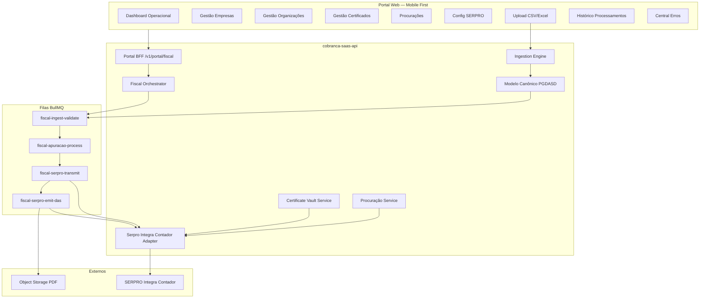
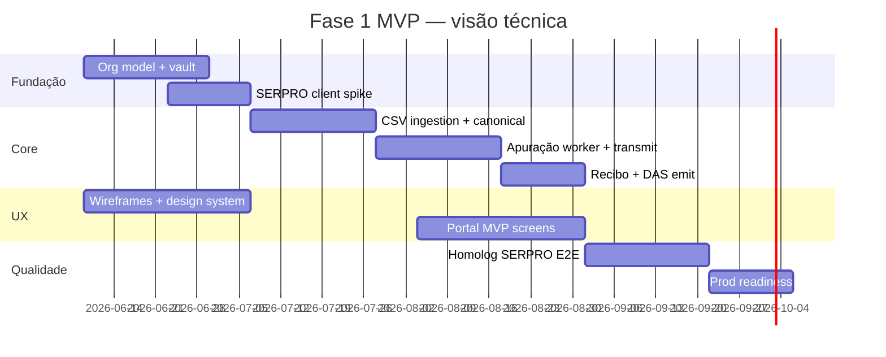

# Documento de Análise Técnica, Arquitetural e Estimativa de Implementação

**Projeto:** Evolução da Plataforma Exeq Tecnologia — Automação Fiscal SERPRO, Apuração PGDAS-D e Emissão de DAS  
**Repositório:** `cobranca-saas-api`  
**Data:** 2026-06-06  
**Metodologia:** Análise obrigatória sobre **código-fonte** (backend, frontend, migrations, infra, CI) complementada por ADRs e documentação operacional existente  
**Referência externa:** [SERPRO Integra Contador](https://apicenter.estaleiro.serpro.gov.br/documentacao/api-integra-contador/)

---

## Sumário executivo

A plataforma Exeq possui **base sólida** para evoluir para automação fiscal SERPRO: módulo `fiscal-guias` (Fase 0–2), certificados A1 cifrados, procuração local, filas BullMQ, portal multi-escritório, console EXEQ Master e padrões de auditoria. **Porém, não há integração SERPRO nativa**, não existe fluxo de apuração PGDAS-D, não há ingestão CSV padronizada e o modelo organizacional ainda é **escritório-centric** (tenant dual UUID/text), insuficiente para BPO, franqueados e parceiros sem refatoração.

**Recomendação:** implementar MVP Fase 1 sobre o módulo fiscal existente, introduzindo camada `serpro-integra-contador`, motor de ingestão com modelo canônico, evolução do modelo organizacional e redesign UX mobile-first — **sem reescrever** cobrança/gateway de pagamento.

**Estimativa Fase 1 (MVP ciclo completo DAS):** **680 a 920 horas-aula** | **16 a 22 semanas** (equipe compacta) | investimento financeiro estimado **R$ 204.000 a R$ 368.000** (faixa de mercado, ver §10).

---

# PARTE I — DIAGNÓSTICO DO ESTADO ATUAL (CÓDIGO-FONTE)

## 1. Diagnóstico da arquitetura backend

### 1.1 Stack e entrypoint

| Item | Evidência no código |
|------|---------------------|
| Linguagem | TypeScript 5.7 (`package.json`, `tsconfig.json`) |
| Runtime | Node.js 20 (CI `.github/workflows/ci.yml`) |
| Framework HTTP | Express 4.21 (`src/app.ts`, `src/server.ts`) |
| Validação | Zod 3 |
| Banco | PostgreSQL 16 via `pg` |
| Filas/cache | Redis + BullMQ 5 (`src/platform/jobs/`) |
| Criptografia | AES-256-GCM (`src/platform/crypto/symmetric-encryption.ts`) |

**Boot:** `src/server.ts` → `createApp()` + `startAllWorkers()` (workers **in-process** com a API).

**Montagem de rotas** (`src/app.ts`):

```
/health, /health/ready
/v1/portal/*     — BFF portal (sem tenant middleware global)
/v1/exeq/*       — Console EXEQ Master
/v1/*            — API core SaaS (tenantResolutionMiddleware)
```

### 1.2 Estrutura modular

Padrão **hexagonal / DDD-lite** em `src/modules/`:

| Módulo | Camadas | Responsabilidade |
|--------|---------|------------------|
| `billing-core` | domain, application, infrastructure, interfaces | Cobranças, status, cancelamento |
| `exeq-platform` | idem | Console master: escritórios, módulos, acesso |
| **`fiscal-guias`** | idem | **DAS/DARF, certificados, procuração, gateway Receita** |
| `identity-access` | application, interfaces | JWT |
| `inbox` | application, infrastructure, interfaces | Webhook inbox |
| `notifications` | domain, application, infrastructure | Email (Resend), WhatsApp (Z-API) |
| `payment-gateway` | domain, application, infrastructure | Asaas, Inter, Cora, C6 |
| `portal-read` | application, domain, infrastructure, interfaces | Login unificado, cobranças, clientes |
| `saas-billing` | idem | Planos, assinaturas, limites |
| `tenant-provisioning` | application, interfaces | Provisionamento tenant público |

**Cross-cutting:** `src/platform/` — persistence, jobs, storage, middleware, audit, certificate-validation, n8n.

**Avaliação:** estrutura **reutilizável** para SERPRO; violação leve de fronteiras — `platform/jobs` importa diretamente de `modules/fiscal-guias`.

### 1.3 Autenticação

| Fluxo | Implementação | Arquivo |
|-------|---------------|---------|
| JWT portal | email/senha → token 15min, claims `{sub, tid, roles}` | `unified-portal-login.ts`, `jwt-service.ts` |
| JWT EXEQ Master | `tid: "__exeq_platform__"`, 8h | `login-platform-master.ts` |
| Middleware tenant portal | Header `x-tenant-id` → `automacao.tenants` | `portal-automacao-tenant-middleware.ts` |
| Membership | `portal.membership` → `req.portalMembership` | `portal-membership-middleware.ts` |
| Mock auth (dev) | `ENABLE_MOCK_AUTH` | `auth-router.ts`, `check-production-env.ts` |

**Débito:** JWT portal sempre carrega `roles: ["owner"]`; autorização real usa `portalMembership.role` — **desacoplamento confuso** para audit e integrações.

### 1.4 RBAC e permissões

**Dois sistemas paralelos:**

1. **JWT roles** (`owner | admin | finance | support | viewer | service_account | cliente_cnpj`) — middleware `requireRoles()` na API core.
2. **Portal membership** (`admin_escritorio | operador | cliente_cnpj`) — validação inline nos routers fiscal e escritório.

**Módulos por escritório** (`portal.tenant_module`): `cobranca`, `clientes`, `notas_fiscais`, `fiscal_guias`, `relatorios` — gerenciados via `exeq-platform`.

**Gap multi-modelo comercial:** não há roles para BPO, franqueado, parceiro; não há hierarquia organizacional além de “escritório = tenant”.

### 1.5 Logs e auditoria

| Tipo | Destino | Arquivo |
|------|---------|---------|
| HTTP access | JSON stdout (`http_access`) | `http-access-log-middleware.ts` |
| Correlation ID | Header propagado | `correlation-id.ts` |
| Audit geral | `public.audit_log` | `platform/audit/audit.service.ts` |
| Audit fiscal | `fiscal.audit_log` | `fiscal-audit.service.ts` |
| Jobs | Structured log BullMQ | `job-structured-log.ts` |

**Ações fiscais auditadas hoje:** upload certificado, capture_requested, capture_failed, guia_disponibilizada, download_pdf, compliance_bloqueio.

**Gap:** não há audit de **apuração/transmissão SERPRO** (inexistente).

### 1.6 Mensageria e processamento assíncrono

**Filas BullMQ** (`src/platform/jobs/queues.ts`):

| Fila | Uso |
|------|-----|
| `payment-emission` | Emissão boleto/PIX |
| `webhook-process` | Inbox webhooks |
| `charge-sync` | Reconciliação gateway |
| `notifications-send` | Régua WhatsApp/email |
| **`fiscal-capture`** | Captura DAS/DARF (se `FISCAL_GUIAS_ENABLED`) |

**Orquestração fiscal:** n8n → `POST /v1/inbox/webhooks` → evento `fiscal.capture.requested` → `fiscal-capture-processor.ts`.

**Avaliação:** padrão assíncrono **já atende** pilar “sem sync usuário↔SERPRO”; falta fila dedicada `fiscal-apuracao` / `fiscal-serpro-transmit`.

### 1.7 Armazenamento de arquivos

| Tipo | Implementação |
|------|---------------|
| PDF guia fiscal | S3 ou local (`get-object-storage.ts`, `upload-fiscal-guia-pdf.ts`) |
| Certificado A1 | Cifrado em `fiscal.certificado_digital` |
| PEM staging upload | Redis/memória TTL 30min (`certificate-upload-store.ts`) |
| Boleto PDF | Stream gateway (não object storage) |

### 1.8 Integrações existentes

| Integração | Status | Relevância SERPRO |
|------------|--------|-------------------|
| Gateway Receita custom | `HttpReceitaFiscalGateway` → `/das|darf/capture` | **Substituir/adaptar** para SERPRO |
| Mock Receita | `scripts/receita-das-mock-gateway.ts` | Homolog local |
| mTLS | `mtls-fetch.ts`, `mtls-agent.ts` | **Reutilizar** para SERPRO A1 |
| n8n bidirecional | inbox + outbound | Reutilizar orquestração |
| Inter/Asaas/Cora/C6 | payment-gateway | Fora do escopo MVP DAS |
| WhatsApp Z-API | notificações guia | Reutilizar pós-emissão DAS |
| **SERPRO Integra Contador** | **Ausente no código** | Desenvolver |

---

## 2. Diagnóstico do frontend atual

### 2.1 Stack

| Item | Detalhe |
|------|---------|
| Framework | React 18 + TypeScript |
| Build | Vite 5 |
| Rotas | react-router-dom v6 (`App.tsx`) |
| Server state | TanStack React Query v5 |
| UI | **CSS custom** — sem MUI/Tailwind (`index.css`, `theme-tokens.css`) |
| Validação | Zod |

### 2.2 Rotas e layouts

- **Portal:** `AppShell.tsx` — sidebar fixa 248px, nav RBAC + módulos (`portal-nav-access.ts`).
- **EXEQ Master:** `ExeqShell.tsx` — gestão escritórios (`ExeqEscritoriosPage`, etc.).
- **Fiscal:** `/guias-fiscais`, `/guias-fiscais/:id`, `/configuracoes/fiscal` (feature flag `VITE_FISCAL_GUIAS_ENABLED`).

### 2.3 Formulários e jornada fiscal atual

| Tela | Estado | Limitação |
|------|--------|-----------|
| Config fiscal | Certificado PEM + procuração manual | Sem validação SERPRO procuração |
| Listagem guias | Tabela 7 colunas, infinite scroll | Sem apuração, sem “solicitar guia” no portal |
| Detalhe guia | PDF, pagamento manual | OK para pós-emissão |
| Dashboard | KPIs cobrança | Sem dashboard fiscal operacional |

### 2.4 Responsividade e UX

| Aspecto | Estado |
|---------|--------|
| Breakpoints CSS | 640–1100px em forms/KPIs |
| Sidebar mobile | **Ausente** — layout desktop fixo |
| Tabelas fiscais | Scroll horizontal; não card-based |
| Mobile First | **Não** — requer redesign integral |
| Feedback tempo real | Polling em emissão cobrança; fiscal sem status live |

### 2.5 Débitos frontend identificados

- `ExeqProtectedRoute.tsx` — possível bug `hasExeqSession` não importado.
- Build portal com erros TS pré-existentes em arquivos não-fiscais.
- Placeholder `/notificacoes` sem UI fiscal.
- Operador não acessa config fiscal (by design) — revisar para MVP.

---

## 3. Diagnóstico do banco de dados

### 3.1 Schemas

| Schema | Origem | Conteúdo principal |
|--------|--------|-------------------|
| `public` | billing-core | `tenants` (UUID), `charges`, RLS, `audit_log`, `escritorio_config` |
| `portal` | multi-escritório | `app_user`, `membership`, `cliente`, `billing_tenant_link`, `tenant_module` |
| `automacao` | legado n8n/NFS-e | `tenants` (TEXT id), `notas_fiscais` |
| **`fiscal`** | guias Fase 0 | certificado, procuração, guia, pagamento, audit |

### 3.2 Entidades fiscais existentes

```
portal.cliente (empresa/CNPJ)
    ├── fiscal.certificado_digital (A1 cifrado)
    ├── fiscal.procuracao (metadata local)
    └── fiscal.guia_fiscal (DAS/DARF pós-captura)
            ├── fiscal.guia_fiscal_versao
            └── fiscal.guia_pagamento
```

**Índices relevantes:** `(tenant_id, portal_cliente_id, competencia)`, idempotency, validade certificado.

### 3.3 Segurança de dados

| Mecanismo | Escopo |
|-----------|--------|
| RLS PostgreSQL | `public.charges`, `portal.cliente` — **não** em `fiscal.*` |
| Isolamento fiscal | Application-layer `tenant_id TEXT` |
| Criptografia app | `ENCRYPTION_KEY` única — certificados e gateway creds |
| FK RESTRICT | Cliente não deletável com guias/certificados |

### 3.4 Backup e auditoria

- **Backup:** não automatizado no repositório; depende infra cloud (Docker local apenas).
- **Auditoria:** `fiscal.audit_log` + `public.audit_log` — padrão reutilizável.

### 3.5 Modelo dual-tenant (risco DBA)

```
automacao.tenants.id (TEXT)  ←→  portal.billing_tenant_link  ←→  public.tenants.id (UUID)
```

Toda operação fiscal/inbox exige mapeamento (`resolve-fiscal-cliente-for-public-tenant.ts`). **Risco de vazamento cross-tenant** se novo código ignorar bridge.

---

## 4. Diagnóstico da infraestrutura

### 4.1 Ambiente atual

| Componente | Local | Produção (inferido) |
|------------|-------|---------------------|
| API | Docker `:3333` | Container Node |
| Postgres | Docker `:5434` | Managed PG 16 |
| Redis | Docker `:6379` | Managed Redis |
| Portal | Host Vite `:5173` | Static/CDN (não no compose) |
| n8n / mock Receita | Host manual | Externo |

### 4.2 CI/CD

**Pipeline** `.github/workflows/ci.yml`: build → testes unitários → migrate → readiness → integração (Postgres + Redis service).

**Ausente:** job fiscal/SERPRO dedicado, deploy automatizado, scan segurança.

### 4.3 Observabilidade

| Recurso | Status |
|---------|--------|
| `/health`, `/health/ready` | ✅ |
| HTTP JSON logs | ✅ |
| SLI admin `/v1/admin/metrics/sli` | ✅ cobrança |
| OpenTelemetry / Prometheus | ❌ |
| Sentry (`SENTRY_DSN`) | Config example only |
| SLI fiscal | ❌ |

### 4.4 Segurança infra

- `check-production-env.ts` — JWT, webhook secret, mock auth off.
- `RECEITA_DAS_TLS_INSECURE` — bypass homolog (risco se vazar prod).
- Workers co-located — blast radius API + jobs.

---

# PARTE II — GAP ANALYSIS (ATUAL vs FUTURO)

## 5. Pilares obrigatórios — matriz de conformidade

| Pilar | Estado atual | Gap | Ação |
|-------|--------------|-----|------|
| **1. Multi-tenant organizacional** | Escritório = tenant; EXEQ master; módulos por tenant | Sem org hierárquica (BPO/franquia/parceiro); dual ID | **Refatorar** → `portal.organization` + memberships |
| **2. Gestão certificados** | A1 em `fiscal.certificado_digital` cifrado; upload PEM validado | Cert em tabela negócio; sem rotação formal; sem vault dedicado | **Refatorar** → `fiscal.certificate_vault` + políticas |
| **3. Procurações** | Cadastro local + validade | Sem consulta SERPRO; sem diagnóstico pré-transmissão | **Evoluir** + integrar `OBTERPROCURACAO41` |
| **4. Rastreabilidade fiscal** | Guia + audit parcial | Sem apuração, protocolo, recibo, valor apurado | **Desenvolver** `fiscal.processamento_fiscal` |
| **5. Assíncrono** | BullMQ + inbox | OK para captura; falta filas apuração/SERPRO | **Estender** filas existentes |

## 6. MVP Fase 1 — checklist funcional (12 passos)

| # | Requisito MVP | Estado atual | Gap |
|---|---------------|--------------|-----|
| 1 | Cadastro empresa | ✅ `portal.cliente` | Reutilizar |
| 2 | Cadastro certificado | ✅ Config fiscal + API | Reutilizar; mover para vault |
| 3 | Configuração SERPRO | ❌ | **Criar** credenciais contratante por org |
| 4 | Upload CSV | ❌ | **Criar** motor ingestão |
| 5 | Validação dados | Parcial (Zod guias) | **Criar** validador PGDASD canônico |
| 6 | Processamento apuração | ❌ | **Criar** worker |
| 7 | Envio SERPRO | ❌ | **Criar** `TRANSDECLARACAO11` |
| 8 | Recibo | ❌ | **Criar** `CONSDECREC15` |
| 9 | Emissão DAS | Parcial (gateway mock) | **Criar** `GERARDAS12` |
| 10 | Armazenamento PDF | ✅ object storage | Reutilizar |
| 11 | Download DAS | ✅ detalhe guia | Reutilizar |
| 12 | Histórico operação | Parcial (lista guias) | **Criar** timeline processamento |

## 7. Integração SERPRO — estudo técnico

### 7.1 Serviços PGDASD (Simples Nacional)

| idServico | Tipo | Função MVP |
|-----------|------|------------|
| `TRANSDECLARACAO11` | Declarar | Envio apuração |
| `CONSULTIMADECREC14` | Consultar | Último recibo |
| `CONSDECREC15` | Consultar | Recibo por PA |
| `GERARDAS12` | Emitir | DAS PDF |

### 7.2 Autenticação SERPRO

| Mecanismo | Uso |
|-----------|-----|
| OAuth2 Loja SERPRO | Token contratante (Exeq ou escritório) |
| mTLS + cert A1 | Operações em nome do contribuinte |
| `AUTENTICAPROCURADOR/ENVIOXMLASSINADO81` | Escritório opera via procuração |
| `PROCURACOES/OBTERPROCURACAO41` | Validação prévia |

### 7.3 Cenários de credencial (MVP)

| Cenário | contratante | autorPedidoDados | contribuinte | Certificado |
|---------|-------------|------------------|--------------|-------------|
| Exeq direto | CNPJ Exeq | CNPJ Exeq | CNPJ cliente | A1 cliente ou Exeq* |
| Escritório | CNPJ Exeq** | CPF/CNPJ contador | CNPJ cliente | A1 escritório ou cliente |
| Credenciais herdadas | CNPJ Exeq | procurador | CNPJ cliente | conforme procuração |

\* Política comercial a definir  
\*\* Modelo típico Loja SERPRO — contratante centralizado Exeq

### 7.4 Tratamento de erros e limites

- Retry idempotente com `idempotency_key` (padrão já em `guia_fiscal`).
- Circuit breaker no client SERPRO.
- Central de erros: persistir `resposta_serpro` + código + mensagem traduzida.
- Rate limit: fila com concorrência configurável (`FISCAL_CAPTURE_CONCURRENCY` como referência).

---

# PARTE III — ARQUITETURA PROPOSTA (TO-BE)

## 8. Visão macro



## 9. Camada de ingestão (abstração obrigatória)

```
┌─────────────┐  ┌─────────────┐  ┌─────────────┐  ┌─────────────┐
│ CSV Adapter │  │Excel Adapter│  │ API Adapter │  │Webhook Adapt│
└──────┬──────┘  └──────┬──────┘  └──────┬──────┘  └──────┬──────┘
       └────────────────┴────────────────┴────────────────┘
                                │
                    ┌───────────▼───────────┐
                    │  CanonicalApuracao    │
                    │  (modelo interno)     │
                    └───────────┬───────────┘
                                │
                    ┌───────────▼───────────┐
                    │ Validation Pipeline   │
                    │ (Zod + regras SN)     │
                    └───────────────────────┘
```

**MVP:** apenas `CsvIngestionAdapter` + contrato interface para futuros adaptadores.

## 10. Modelo organizacional proposto

**Substituir** conceito limitado “conta pai” por:

```sql
-- Proposta migration 032+
portal.organization (
  id UUID PK,
  slug TEXT UNIQUE,
  type TEXT CHECK IN ('exeq','escritorio','bpo','franqueado','parceiro'),
  parent_organization_id UUID NULL FK organization,
  status TEXT,
  metadata JSONB
)

portal.organization_membership (
  organization_id, app_user_id, role, ...
)

-- tenant_id TEXT permanece para compatibilidade;
-- organization_id torna-se eixo comercial principal
```

Escritórios atuais migram 1:1 para `type=escritorio`.

## 11. Certificate Vault (separado de negócio)

```sql
fiscal.certificate_vault (
  id, organization_id, portal_cliente_id NULL,
  owner_type CHECK ('empresa','escritorio','exeq'),
  cert_encrypted, key_encrypted, encryption_iv,
  valid_from, valid_until, rotation_of UUID NULL,
  status CHECK ('active','expiring','revoked','expired')
)
```

Tabelas de negócio referenciam `certificate_vault_id`, **não** PEM inline.

## 12. Processamento fiscal rastreável

```sql
fiscal.processamento_fiscal (
  id UUID PK,
  organization_id, portal_cliente_id,
  competencia TEXT,
  tipo TEXT CHECK ('PGDASD_APURACAO'),
  status TEXT, -- RASCUNHO, VALIDANDO, VALIDADO, TRANSMITINDO,
               -- TRANSMITIDA, RECIBO_OK, EMITINDO_DAS, CONCLUIDO, ERRO
  valor_apurado NUMERIC,
  protocolo_serpro TEXT,
  recibo_storage_key TEXT,
  guia_fiscal_id UUID NULL FK,
  erro_codigo TEXT, erro_detalhe JSONB,
  idempotency_key TEXT UNIQUE,
  correlation_id TEXT,
  created_at, updated_at
)

fiscal.processamento_evento (
  processamento_id, evento, payload JSONB, created_at
) -- timeline auditável
```

---

# PARTE IV — REAPROVEITAMENTO, REFATORAÇÃO E NOVO

## 13. Matriz de decisão

| Componente | Decisão | Justificativa (código) |
|------------|---------|------------------------|
| Módulo `fiscal-guias` | **Reaproveitar** | Estrutura madura, testes integração |
| `ReceitaFiscalGateway` interface | **Reaproveitar** | Seam para `SerproFiscalGateway` |
| `HttpReceitaFiscalGateway` | **Substituir** em prod | Não é SERPRO |
| BullMQ + inbox pattern | **Reaproveitar** | Já assíncrono |
| mTLS stack | **Reaproveitar** | Inter + Receita já usam |
| PEM validation | **Reaproveitar** | LLD-CERT-001 recente |
| Object storage PDF | **Reaproveitar** | S3/local pronto |
| `fiscal.guia_fiscal` | **Reaproveitar** | Destino pós-GERARDAS12 |
| `fiscal.certificado_digital` | **Refatorar** → vault | Pilar certificados |
| `fiscal.procuracao` | **Refatorar** + SERPRO | Diagnóstico pré-transmissão |
| Dual tenant UUID/TEXT | **Refatorar** gradual | Risco arquitetural |
| Portal AppShell sidebar | **Refatorar** UX | Mobile first |
| JWT roles portal | **Refatorar** | Alinhar membership |
| `portal.cliente` | **Reaproveitar** | Cadastro empresa MVP |
| exeq-platform console | **Reaproveitar** | Gestão org Fase 1 parcial |
| n8n capture trigger | **Reaproveitar** opcional | Portal pode disparar direto |
| Cobrança/payment-gateway | **Manter** | Fora escopo MVP |
| DCTFWeb SERPRO | **Desenvolver do zero** | Fase 3 |
| ERP API adapters | **Desenvolver do zero** | Fase 2 |
| SERPRO OAuth client | **Desenvolver do zero** | |
| CSV ingestion | **Desenvolver do zero** | |
| 11 telas UX novas | **Desenvolver do zero** | Redesign, não patch |

---

# PARTE V — PLANOS E CRONOGRAMAS

## 14. Plano de implementação — Fase 1 (MVP)

| Sprint | Entrega | Dependências |
|--------|---------|--------------|
| S0 | Discovery SERPRO demo + credenciais + UX wireframes | Contrato Loja SERPRO |
| S1 | Organization model + migration + SERPRO config API | S0 |
| S2 | Certificate vault + migração dados cert | S1 |
| S3 | Ingestion engine CSV + validação canônica | S2 |
| S4 | Serpro adapter OAuth + CONSULTIMADECREC14 spike | Credenciais |
| S5 | Worker apuração + TRANSDECLARACAO11 + processamento_fiscal | S3, S4 |
| S6 | Recibo CONSDECREC15 + storage | S5 |
| S7 | GERARDAS12 → guia_fiscal + download | S6 |
| S8 | Portal telas MVP + dashboard + histórico + erros | S5–S7 |
| S9 | Homolog E2E SERPRO demo + QA + documentação | S8 |
| S10 | Hardening segurança + observabilidade fiscal | S9 |

## 15. Plano de migração

| Etapa | Ação | Risco |
|-------|------|-------|
| M1 | Criar `organization` e backfill escritórios existentes | Baixo |
| M2 | Migrar certificados → vault (script idempotente) | Médio — validar decrypt |
| M3 | Manter `fiscal.certificado_digital` read-only deprecated 1 release | Baixo |
| M4 | Feature flag `FISCAL_SERPRO_ENABLED` por org | Baixo |
| M5 | Ambiente homolog SERPRO demo antes prod | Alto se pulado |
| M6 | Dual-run gateway Exeq + SERPRO 2 semanas | Médio |

**Rollback:** feature flags desligam SERPRO; guias existentes intactas (schema fiscal só CREATE).

## 16. Cronograma executivo

| Marco | Semana | Entregável |
|-------|--------|------------|
| Kickoff + credenciais SERPRO | 1 | Acesso demo validado |
| Arquitetura + UX aprovados | 2 | Wireframes + LLD |
| Ingestão CSV operacional | 5 | Upload + validação |
| Primeira transmissão homolog | 8 | Protocolo + recibo |
| **MVP ciclo completo DAS** | **12–14** | CSV → SERPRO → DAS PDF |
| Piloto escritório | 16–18 | 1 cliente real homolog |
| Produção controlada | 20–22 | Feature flag gradual |

**Duração Fase 1:** 16–22 semanas calendário (equipe abaixo).

## 17. Cronograma técnico (dependências)



---

# PARTE VI — ESTIMATIVAS

## 18. Premissas de estimativa

- 1 hora-aula = 1 hora produtiva.
- Equipe compacta Fase 1: 1,5 backend, 1 frontend, 0,5 UX, 0,25 DBA, 0,25 DevOps, 0,5 QA, 0,25 arquiteto, 0,25 PM.
- Contingência **15%** integração externa SERPRO incluída nos ranges max.
- **Não inclui:** contratação SERPRO, certificação contábil, integração ERP completa.

## 19. Fase 1 — MVP (ciclo completo DAS)

| Perfil | Horas min | Horas max | Principais atividades |
|--------|-----------|-----------|----------------------|
| **Arquitetura** | 48 | 64 | Org model, vault, ingestion ADR, revisão segurança |
| **Backend** | 240 | 320 | SERPRO adapter, workers, APIs, procuração SERPRO |
| **Frontend** | 140 | 200 | 11 telas, mobile shell, polling status |
| **UX/UI** | 80 | 120 | Research, wireframes, design system fiscal |
| **DBA** | 32 | 48 | Migrations 032+, backfill, índices, audit |
| **DevOps** | 40 | 56 | Secrets SERPRO, CI job fiscal, observabilidade |
| **QA** | 72 | 104 | Testes integração, E2E homolog, regressão portal |
| **Gestão de Projeto** | 48 | 64 | Sprints, riscos, homolog com PO |
| **SUBTOTAL Fase 1** | **700** | **976** | |
| **Total recomendado (média)** | | **~860 h** | |

## 20. Fases subsequentes

| Fase | Escopo | Horas min | Horas max |
|------|--------|-----------|-----------|
| **Fase 2** | APIs ERP (webhook + REST ingestão) | 120 | 180 |
| **Fase 3** | DCTFWeb (`TRANSDECLARACAO310`, `CONSRECIBO32`, `GERARGUIA31`) | 200 | 300 |
| **Fase 4** | Franquia/parceiro billing, MIT, parcelamentos SN, analytics | 160 | 280 |

## 21. Estimativa financeira

Faixa horária média Fase 1: **860 h**.

| Cenário | R$/hora blended | Investimento Fase 1 |
|---------|-----------------|---------------------|
| Fábrica enxuta | R$ 250/h | **R$ 215.000** |
| Mercado mid | R$ 320/h | **R$ 275.200** |
| Premium especializado | R$ 400/h | **R$ 344.000** |

| Fase | Horas (média) | R$ 320/h |
|------|---------------|----------|
| Fase 1 MVP | 860 | R$ 275.200 |
| Fase 2 ERP | 150 | R$ 48.000 |
| Fase 3 DCTFWeb | 250 | R$ 80.000 |
| Fase 4 evoluções | 220 | R$ 70.400 |
| **Total programa** | **~1.480 h** | **~R$ 473.600** |

*Valores indicativos; ajustar tabela de rates por perfil na proposta comercial.*

---

# PARTE VII — RISCOS, DEPENDÊNCIAS, QUALIDADE

## 22. Mapa de riscos

| ID | Risco | Prob. | Impacto | Mitigação |
|----|-------|-------|---------|-----------|
| R1 | Credenciais SERPRO atrasadas | Alta | Alto | Spike S0; mock contract tests |
| R2 | Payload PGDASD complexo | Alta | Alto | MVP CSV layout fixo documentado |
| R3 | Dual tenant bug cross-org | Média | Crítico | Testes integração cross-tenant; RLS fiscal futuro |
| R4 | Procuração inválida em lote | Alta | Médio | Pré-check OBTERPROCURACAO41 + central erros |
| R5 | UX mobile insuficiente | Média | Médio | UX dedicado sprint 0–2 |
| R6 | ENCRYPTION_KEY única comprometida | Baixa | Crítico | Roadmap KMS por org |
| R7 | Workers co-located sob carga | Média | Médio | Extrair workers fiscal p/ serviço separado Fase 2 |
| R8 | Indisponibilidade SERPRO | Média | Alto | Filas + retry + DLQ (padrão existente) |

## 23. Dependências externas

| Dependência | Responsável | Bloqueante MVP? |
|-------------|-------------|-----------------|
| Contrato Loja SERPRO (CNPJ contratante) | Exeq comercial | **Sim** |
| Ambiente demo SERPRO | SERPRO | **Sim** |
| Certificados A1 clientes piloto | Escritório/cliente | **Sim** |
| Procurações e-CAC válidas | Cliente | **Sim** |
| Layout CSV PGDASD acordado | PO + contabilidade | **Sim** |
| S3 produção (PDF) | DevOps | Não (local homolog) |
| n8n (opcional) | Exeq infra | Não |

## 24. Estratégia de homologação

| Nível | Escopo | Ferramenta |
|-------|--------|------------|
| L0 | Mock gateway (regressão) | `receita-das-mock-gateway.ts` |
| L1 | SERPRO swagger demo | Manual + script spike |
| L2 | SERPRO demo automatizado | `scripts/fiscal-serpro-homolog-e2e.ts` (criar) |
| L3 | Piloto 1 CNPJ real homolog | Checklist escritório |
| L4 | Produção 5% orgs feature flag | Monitoramento SLI fiscal |

**Evidências:** padrão `docs/evidencias/fiscal-homolog-e2e-*.json` existente.

**Critério aceite MVP:** empresa importa CSV → transmissão `TRANSDECLARACAO11` → recibo PDF → `GERARDAS12` → download DAS → histórico auditável.

## 25. Estratégia de testes

| Camada | Cobertura Fase 1 |
|--------|------------------|
| Unitário | Parsers CSV, canonical model, SERPRO response mappers, status transitions |
| Integração | `tests/fiscal-guias/*` estendido; cross-tenant processamento |
| Contrato | Fixtures SERPRO demo responses (sem chamar prod em CI) |
| E2E | Script homolog + Playwright fluxo upload→download |
| Segurança | Cert vault, org isolation, rate limit upload |
| Performance | Fila 100 processamentos concorrentes (Redis) |
| Regressão | CI existente + job `fiscal-serpro` opcional |

---

# PARTE VIII — TELAS UX (escopo design)

| Tela | Prioridade MVP | Base atual |
|------|----------------|------------|
| Dashboard Operacional | P0 | Nova |
| Gestão Empresas | P0 | Estender `ClientesPage` |
| Gestão Organizações | P1 | Estender EXEQ console |
| Gestão Certificados | P0 | Refatorar `ConfigFiscalPage` |
| Gestão Procurações | P0 | Refatorar tab procuração |
| Configuração SERPRO | P0 | Nova |
| Upload Arquivos | P0 | Nova |
| Histórico Processamentos | P0 | Nova |
| Central Erros | P0 | Nova |
| Download DAS | P0 | `GuiaFiscalDetalhePage` |
| Auditoria | P1 | Nova (admin) |

**Diretrizes:** mobile first, sidebar colapsável, cards no lugar de tabelas em mobile, stepper para fluxo CSV→transmissão→DAS, polling/WebSocket status processamento.

---

# PARTE IX — CONCLUSÃO E PRÓXIMOS PASSOS

## 26. Síntese para decisão

A Exeq **não parte do zero** no fiscal: possui ~40–60% da infraestrutura necessária (certificados, filas, guias, portal, audit). O gap crítico está em **SERPRO nativo**, **apuração PGDAS-D**, **ingestão CSV**, **modelo organizacional escalável** e **UX mobile operacional**.

Investimento Fase 1 recomendado: **~860 horas / R$ 275k (mid)** em **16–22 semanas** para cumprir o objetivo de negócio: *importar dados, transmitir SERPRO, apurar e baixar DAS*.

## 27. Ações imediatas (Sprint 0)

1. PO confirmar CNPJ contratante SERPRO e abrir processo Loja SERPRO.
2. Arquiteto validar layout CSV PGDASD MVP com contabilidade.
3. UX iniciar wireframes Dashboard + Upload + Stepper transmissão.
4. Backend spike: OAuth SERPRO + `CONSULTIMADECREC14` em homolog demo.
5. DBA draft migration `032_organization_and_processamento_fiscal.sql`.

---

## Anexos

| Anexo | Caminho |
|-------|---------|
| ADR Fiscal Guias Fase 0 | `docs/ADR_FISCAL_GUIAS_FASE0.md` |
| Análise SERPRO endpoints | `docs/ANALISE_INTEGRACAO_SERPRO_APURACAO_DAS_DARF.md` |
| Mapeamento campos fiscal | `docs/FISCAL_GUIAS_MAPEAMENTO_CAMPO.md` |
| Homolog E2E atual | `docs/FISCAL_HOMOLOG_E2E.md` |
| Gateway interface | `src/modules/fiscal-guias/domain/receita-gateway.interface.ts` |
| Fiscal processor | `src/platform/jobs/application/fiscal-capture-processor.ts` |

---

*Documento produzido com base em leitura direta do código-fonte em 2026-06-06. Versão 1.0.*
