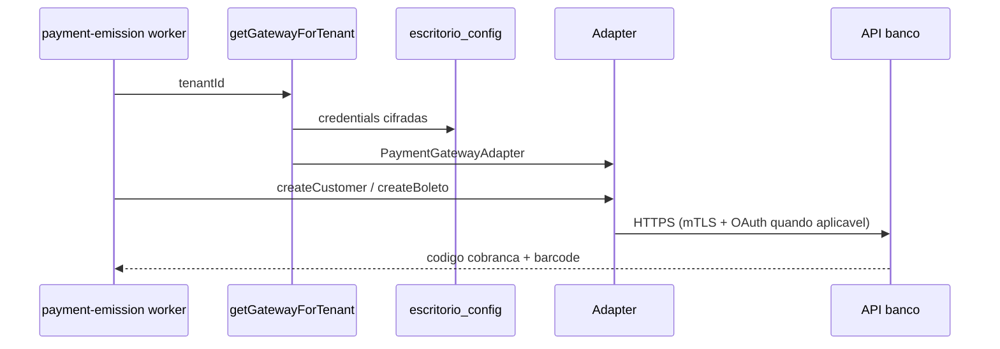

# Gateway universal (Sprint L)

Arquitetura de emissão multi-provedor: **Asaas**, **Banco Inter** e **Cora**.

## Fluxo



## Pontos de codigo

| Componente | Caminho |
|------------|---------|
| Factory | `src/modules/payment-gateway/application/get-gateway-for-tenant.ts` |
| Registry | `src/platform/payment-gateway/provider-registry.ts` |
| Worker emissao | `src/platform/jobs/application/payment-emission-processor.ts` |
| Credenciais portal | `PATCH /v1/portal/escritorio/config` com `gateway_credentials` |
| Providers API | `GET /v1/portal/escritorio/gateway/providers` |

## Credenciais

- **Asaas (legado):** `gateway_api_key_encrypted` ou JSON `{ "api_key": "..." }`.
- **Inter / Cora:** `gateway_credentials_encrypted` (JSON cifrado) — ver migration `025_gateway_credentials_universal.sql`.

## Sprint M (fase 2)

- Adapter **C6 Bank** (`oauth_basic`, sem mTLS no token).
- Tabela `gateway_change_log` + `PATCH /v1/portal/escritorio/gateway` (troca permitida com log).
- Portal: credenciais dinâmicas via `GATEWAY_REGISTRY`.
- **BB:** sprint futura (credenciais sandbox PO).

## Banco Inter — PDF (Sprint N)

- Emissão persiste placeholder `inter://cobranca/{codigoSolicitacao}/pdf` em `payment_transactions.boleto_pdf_url`.
- Download real: `GET /cobrancas/v2/{codigoSolicitacao}/pdf` (mTLS + OAuth), implementado em `InterAdapter.downloadBoletoPdf`.
- Portal expõe proxy autenticado: `GET /v1/portal/cobrancas/:id/boleto.pdf` (staff JWT + tenant). O detalhe da cobrança devolve `boleto_pdf_url` como esse path relativo.
- Testes unitários mockam `InterHttpClient.requestPdf` (sem certificado no CI).

## Banco Inter — Webhook (Sprint N)

- Inbox genérico: `POST /v1/webhooks` com `source: inter` ou payload `{ codigoSolicitacao, situacao, ... }`.
- Parser: `parse-inter-webhook.ts` → `provider_charge_id` = `codigoSolicitacao`, status via `mapInterChargeStatus`.
- Processamento: mesma fila `webhook_inbox` / `process-webhook-inbox` (atualiza `charges` + `charge_events`).
- Fixture de exemplo: `tests/fixtures/inter-webhook-pago.json`.

## Homolog sandbox (opt-in)

```bash
RUN_INTER_SANDBOX=1 npm run gateway:smoke:inter
RUN_CORA_SANDBOX=1 npm run gateway:smoke:cora
RUN_C6_SANDBOX=1 npm run gateway:smoke:c6
```

Referencia de payloads HTTP: `Projeto_CobrancaBoleto/ESTUDO_APIS_BANCARIAS.md`.  
Spec executavel: `Projeto_CobrancaBoleto/DEMANDA_SPRINT_L_UNIVERSAL_GATEWAY.md`.
