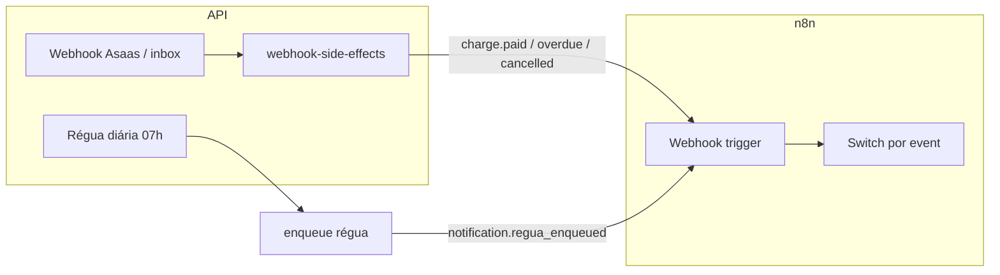

# n8n — workflow exemplo (cobrança + régua)

Guia operacional para homologação **Sprint E**. Complementa [N8N_WEBHOOKS.md](./N8N_WEBHOOKS.md) (contrato outbound) e [INBOX_WEBHOOK_IDEMPOTENCIA.md](./INBOX_WEBHOOK_IDEMPOTENCIA.md) (entrada).

## Workflows JSON (import no n8n)

Arquivos versionados para QA — ver [n8n/README.md](./n8n/README.md):

| Arquivo | Função |
|---------|--------|
| [n8n/workflows/cobranca-saas-events.workflow.json](./n8n/workflows/cobranca-saas-events.workflow.json) | **Outbound** — Webhook `cobranca-saas-events` + Switch dos 6 eventos |
| [n8n/workflows/cobranca-saas-inbox-homolog.workflow.json](./n8n/workflows/cobranca-saas-inbox-homolog.workflow.json) | **Inbound** — teste manual dedup inbox |

Smoke local após import: `npm run n8n:smoke:outbound`

## Pré-requisitos

```env
N8N_PLATFORM_WEBHOOK_URL=https://<n8n>/webhook/cobranca-saas-events
N8N_PLATFORM_WEBHOOK_SECRET=<opcional>
WEBHOOK_INBOX_SECRET=<para n8n chamar a API>
```

Pipeline interno Resend/Z-API **permanece ativo** — n8n orquestra CRM, tarefas, métricas externas.

---

## Fluxo outbound (API → n8n)



| Evento | Ação sugerida no n8n |
|--------|---------------------|
| `charge.paid` | Atualizar CRM, fechar tarefa de cobrança |
| `charge.overdue` | Abrir tarefa de recuperação; alertar CS |
| `charge.cancelled` | Encerrar sequências ativas no CRM |
| `notification.regua_enqueued` | Log/métrica (e-mail/WhatsApp segue na API) |
| `subscription.past_due` | Fluxo retenção SaaS |

### Switch (exemplo)

No nó **Switch**, regra por `$json.event`:

- `charge.paid` → ramo CRM pago
- `charge.overdue` → ramo inadimplência
- `charge.cancelled` → ramo cancelamento
- `notification.regua_enqueued` → ramo observabilidade (opcional)
- `subscription.past_due` → ramo assinatura

Validar `X-Webhook-Secret` no primeiro nó IF se `N8N_PLATFORM_WEBHOOK_SECRET` estiver definido.

---

## Fluxo inbound (n8n → API)

Quando o workflow n8n precisa **informar** a API (ex.: status customizado, integração legada):

```http
POST /v1/inbox/webhooks
X-Tenant-Id: demo
X-Webhook-Secret: <WEBHOOK_INBOX_SECRET>
X-External-Event-Id: n8n-<workflow>-<execution-id>
Content-Type: application/json

{
  "canonical_status": "pendente_pagamento",
  "reference": "<reference-da-cobranca>"
}
```

- **Sempre** usar `X-External-Event-Id` estável por execução (dedup Sprint D).
- Reenvio com mesmo ID → **200** `deduplicated: true` (não reprocessar no n8n).

Depois, processar fila (JWT admin):

```http
POST /v1/inbox/webhooks/process-pending?limit=25
Authorization: Bearer <token>
X-Tenant-Id: demo
```

---

## Idempotência no n8n

| Direção | Chave sugerida |
|---------|----------------|
| Outbound | `$json.event` + `$json.payload.charge_id` (ou `subscription_id`) |
| Inbound | `X-External-Event-Id` gerado uma vez por execução |

A API pode reenviar outbound em retries; workflows devem ser idempotentes.

---

## Smoke local (sem n8n real)

1. Deixar `N8N_PLATFORM_WEBHOOK_URL` vazio → API em noop (sem erro).
2. Com URL apontando para webhook de teste do n8n → disparar cobrança vencida no sandbox e ver `charge.overdue` + `notification.regua_enqueued`.

Ver [DEPLOY_CHECKLIST.md](./DEPLOY_CHECKLIST.md) para variáveis em staging/produção.
