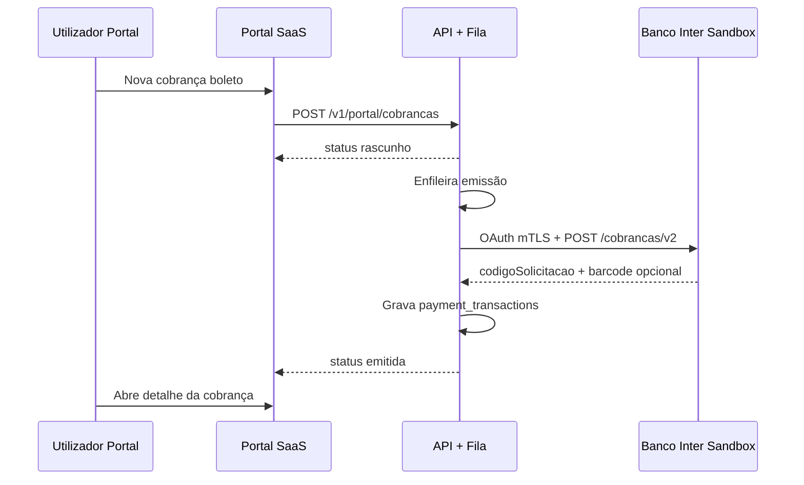

# Caso de teste PO — Emissão de boleto com Banco Inter (integração ponta a ponta)

**ID:** PO-INT-EMISSAO-001  
**Papel:** PO · QA · Tech Lead (apoio técnico)  
**Prioridade:** P0 — bloqueia aceite da homologação Inter  
**Objetivo de negócio:** Comprovar que, com o gateway **Banco Inter** já configurado no escritório, o utilizador consegue **gerar um boleto pelo sistema** (portal) e que a cobrança fica **integrada** ao Inter (identificador externo + dados de pagamento persistidos), sem expor credenciais.

**Referências:** [QA_HOMOLOG_INTER_GATEWAY_PORTAL.md](./QA_HOMOLOG_INTER_GATEWAY_PORTAL.md) · [QA_INTER_SETUP_GUIA_PASSO_A_PASSO.md](./QA_INTER_SETUP_GUIA_PASSO_A_PASSO.md) · [evidencias/INTER_HOMOLOG_TEMPLATE.md](./evidencias/INTER_HOMOLOG_TEMPLATE.md)

---

## 1. Escopo do teste

| Dentro do escopo | Fora do escopo (aceite separado) |
|------------------|----------------------------------|
| Criar cobrança **boleto** no portal | Pagamento real do boleto pelo pagador |
| Emissão assíncrona via worker + adapter Inter | Webhook Inter → baixa automática no SaaS |
| Status `rascunho` → `emitida` | PDF oficial hospedado (pode ser placeholder) |
| `provider_charge_id` = UUID Inter (`codigoSolicitacao`) | Cobrança **PIX** com gateway Inter (INT-09) |
| Linha digitável / código de barras **se** sandbox devolver | Consulta de saldo/extrato Inter |

---

## 2. Pré-condições (PO assina antes de executar)

### 2.1 Ambiente

| # | Condição | Como validar |
|---|----------|--------------|
| P1 | API atual (Sprint L/M) no ar | `GET http://localhost:3334/health` → `status: ok` |
| P2 | Portal no ar | `http://localhost:5173/login` abre |
| P3 | Migrations **025** e **026** aplicadas | `npm run migrate` → sem pendências |
| P4 | **Redis** ativo + worker de emissão | Log API: `[workers] BullMQ ativo` e `[payment-emission]` ao emitir |
| P5 | `ENCRYPTION_KEY` estável no `.env` | Mesma chave desde que guardou credenciais Inter |

### 2.2 Gateway Inter já configurado (pré-requisito deste teste)

| # | Condição | Evidência |
|---|----------|-----------|
| G1 | `gateway_provider` = `inter` | Configurações → **Banco Inter** selecionado |
| G2 | Credenciais salvas (cifradas) | Mensagem *Credenciais já configuradas* após F5 |
| G3 | **Client ID** e **Client Secret** são os do sandbox Inter (não e-mail de login) | Conferência com pacote PO |
| G4 | **Certificado PEM** e **Chave privada PEM** válidos | Token OAuth direto no Inter OK (opcional, recomendado) |

### 2.3 Utilizador e dados de teste

| Campo | Valor seed |
|-------|------------|
| Login | `portal-seed@local.dev` / `escritorio-demo` / `PortalSeedDev!ChangeMe1` |
| Papel | `admin_escritorio` |
| Cliente | CPF/CNPJ válido, nome e e-mail preenchidos |
| Cobrança | Valor > 0, vencimento **≥ 5 dias** no futuro, tipo **boleto** |

---

## 3. Fluxo de integração (visão PO)



**Critério de negócio:** o escritório **não** precisa aceder ao Internet Banking Inter para emitir este boleto de teste — tudo foi feito pelo portal SaaS.

---

## 4. Passos de execução (portal — caminho principal)

| Passo | Ação (menu / tela) | Resultado esperado |
|-------|-------------------|-------------------|
| **1** | Login em http://localhost:5173/login | Dashboard abre |
| **2** | Sidebar **Clientes** → **Novo cliente** (ou cliente existente) | Cliente com documento e e-mail gravados |
| **3** | Sidebar **Boletos** → botão **Nova cobrança** | Formulário *Nova cobrança* |
| **4** | Preencher **Referência**, **Valor**, **Vencimento**, selecionar **Cliente** → submeter | Redireciona para detalhe da cobrança |
| **5** | Na tela de detalhe, verificar status inicial | **Rascunho** (ou equivalente na UI) |
| **6** | Aguardar **5 a 60 segundos** (sandbox pode responder `EM_PROCESSAMENTO`) | Atualizar página (F5) |
| **7** | Verificar status final | **Emitida** |
| **8** | No painel de pagamento do detalhe | **Linha digitável** e/ou **código de barras** visíveis *se* Inter devolveu; link PDF pode ser `inter://...` (aceite conhecido) |
| **9** | Sidebar **Boletos** → filtrar **Emitida** | Cobrança de teste listada |

**Falha imediata:** se após 60 s permanecer **Erro emissão** → registrar logs API (`[payment-emission]`) e abrir bug P0 (não assinar aceite).

---

## 5. Validação da integração sistema ↔ Inter (critérios de aceite PO)

### 5.1 Portal (experiência do escritório)

| ID | Critério | Pass / Fail |
|----|----------|-------------|
| AC-01 | Cobrança criada sem erro de validação | ☐ |
| AC-02 | Status transita de rascunho para **emitida** sem intervenção manual no Inter | ☐ |
| AC-03 | Detalhe exibe dados de boleto (barcode/linha) ou mensagem coerente se sandbox incompleto | ☐ |
| AC-04 | Nenhuma credencial Inter (PEM/secret) visível na UI ou no DevTools | ☐ |

### 5.2 API (opcional — Postman ou DevTools)

Executar após passo 7, com `charge_id` da cobrança:

```http
GET http://localhost:3334/v1/portal/cobrancas/{charge_id}
Authorization: Bearer <token>
x-tenant-id: 1
```

| Campo JSON | Esperado |
|------------|----------|
| `charge.canonicalStatus` | `emitida` |
| `charge.provider` | `inter` |
| `charge.providerChargeId` | UUID não vazio (formato `codigoSolicitacao`) |
| `payment.boleto_barcode` ou linha equivalente | Preenchido se Inter devolveu (senão null — anotar) |

**Collection:** pasta **3 — Cobrança** em `postman/Inter_Gateway_Homolog.postman_collection.json` (exige PEM real e `pemConfigured=true`).

### 5.3 Base de dados (confirmação definitiva da integração)

```sql
-- Última cobrança do tenant de teste
SELECT id, reference, amount, canonical_status, provider, provider_charge_id, created_at
FROM charges
ORDER BY created_at DESC
LIMIT 3;

SELECT gateway, gateway_transaction_id, boleto_barcode, type, created_at
FROM payment_transactions
ORDER BY created_at DESC
LIMIT 3;
```

| ID | Critério | Pass / Fail |
|----|----------|-------------|
| AC-05 | `charges.canonical_status` = `emitida` | ☐ |
| AC-06 | `charges.provider` = `inter` | ☐ |
| AC-07 | `charges.provider_charge_id` = UUID do Inter | ☐ |
| AC-08 | `payment_transactions.gateway` = `inter` | ☐ |
| AC-09 | `payment_transactions.gateway_transaction_id` = mesmo UUID | ☐ |
| AC-10 | Evento de auditoria / `charge_events` com transição para emitida (se exposto) | ☐ |

### 5.4 Banco Inter (validação externa — recomendada PO)

Com as **mesmas** credenciais sandbox (Postman `Projeto_CobrancaBoleto/postman/Inter_Sandbox.*`):

| Passo | Ação | Esperado |
|-------|------|----------|
| E1 | `POST /oauth/v2/token` (mTLS) | HTTP 200 + `access_token` |
| E2 | `GET /cobrancas/v2/{codigoSolicitacao}` usando `provider_charge_id` do passo 5.3 | Situação `EM_ABERTO` ou `EM_PROCESSAMENTO` / dados coerentes com valor e vencimento |

**Aceite PO:** E2 confirma que o boleto **existe no Inter** e foi criado pela integração (não é mock interno).

---

## 6. Matriz de rastreabilidade

| Cenário homolog | Este teste |
|-----------------|------------|
| INT-05 Emissão boleto | Passos 4–7, AC-01 a AC-03 |
| INT-06 payment_transactions | AC-05 a AC-09 |
| INT-03 Gateway configurado | Pré-condição G1–G4 |
| INT-04 Secrets mascarados | AC-04 |

---

## 7. Dados do caso de teste (preencher na execução)

| Campo | Valor usado no teste |
|-------|----------------------|
| Data execução | |
| Executor (QA) | |
| `reference` / referência | ex. `PO-INT-20260522-001` |
| `charge_id` (UUID) | |
| `provider_charge_id` (Inter) | |
| Valor (R$) | |
| Vencimento | |
| `portal_cliente_id` | |
| Tempo rascunho → emitida (s) | |

---

## 8. Evidências obrigatórias para aceite PO

| # | Evidência | Arquivo sugerido |
|---|-----------|------------------|
| 1 | Print lista **Boletos** com status **Emitida** | `prints/PO_INT_emissao_lista.png` |
| 2 | Print **detalhe** com barcode/linha (secrets borrados) | `prints/PO_INT_emissao_detalhe.png` |
| 3 | JSON `GET /cobrancas/{id}` mascarado | colar em `INTER_HOMOLOG_*.md` |
| 4 | Print SQL `charges` + `payment_transactions` | `prints/PO_INT_emissao_sql.png` |
| 5 | (Opcional) Print consulta boleto no Postman Inter | `prints/PO_INT_inter_consulta.png` |
| 6 | Trecho log `[payment-emission]` sucesso (sem PEM) | `logs/PO_INT_emissao.txt` |

---

## 9. Cenários negativos (mesma sessão ou regressão)

| ID | Ação | Resultado esperado |
|----|------|-------------------|
| N1 | Revogar/alterar PEM inválido + nova cobrança | `erro_emissao` + mensagem compreensível |
| N2 | API sem Redis (worker parado) | Permanece `rascunho` > 2 min → bug infra |
| N3 | Cobrança PIX com gateway Inter | `erro_emissao` ou validação clara (INT-09) |

---

## 10. Veredito PO

| Resultado | Condição |
|-----------|----------|
| **Aprovado** | AC-01 a AC-09 Pass; E2 Pass ou justificativa documentada do sandbox |
| **Aprovado com ressalva** | Emitida OK mas sem barcode (sandbox); PDF placeholder |
| **Reprovado** | `erro_emissao` sem causa externa; `provider` ≠ `inter`; sem `provider_charge_id` |

**Assinatura PO:** _______________________ **Data:** __________  

**Observações:**

---

## 11. Alternativa API-only (se portal indisponível)

Mesma lógica de negócio via Postman (pasta **3**), após pastas 0–2:

1. `POST /v1/portal/clientes`  
2. `POST /v1/portal/cobrancas` (type `boleto`)  
3. Repetir `GET /v1/portal/cobrancas/{id}` até `canonicalStatus` = `emitida`  
4. Validar AC-05 a AC-09 no SQL  

---

*Documento alinhado ao adapter Inter (`POST /cobrancas/v2`) e ao worker `charges-emission`. Atualizar se o contrato Inter ou os status canónicos mudarem.*
