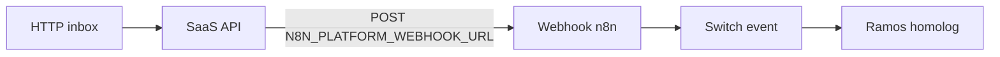

# n8n — pacote de homologação (fábrica Sprint E)

Workflows versionados para importar no orquestrador e testar a integração **bidirecional** com a API SaaS Cobranças.

| Documento | Uso |
|-----------|-----|
| Este README | Setup PO / QA / DevOps |
| [../N8N_WEBHOOKS.md](../N8N_WEBHOOKS.md) | Contrato outbound (eventos) |
| [../N8N_REGUA_WORKFLOW_EXEMPLO.md](../N8N_REGUA_WORKFLOW_EXEMPLO.md) | Fluxo negócio régua |
| [../INBOX_WEBHOOK_IDEMPOTENCIA.md](../INBOX_WEBHOOK_IDEMPOTENCIA.md) | Inbound inbox |

## Diretório dos JSON (import no n8n)

```
docs/n8n/workflows/
├── cobranca-saas-events.workflow.json      ← outbound (API → n8n) — PRINCIPAL
└── cobranca-saas-inbox-homolog.workflow.json ← inbound (n8n → API) — homolog manual
```

**Importar:** n8n → Workflows → **Import from file** → escolher o `.json` acima → **Activate** (workflow outbound).

## Arquitetura (visão Tech Lead)



| Direção | Variável API | Header |
|---------|--------------|--------|
| API → n8n | `N8N_PLATFORM_WEBHOOK_URL` | `X-Webhook-Secret` = `N8N_PLATFORM_WEBHOOK_SECRET` |
| n8n → API | `WEBHOOK_INBOX_SECRET` | `X-Webhook-Secret` + `X-External-Event-Id` |

## Configuração — API (`.env`)

```env
# Outbound (API dispara o workflow)
N8N_PLATFORM_WEBHOOK_URL=http://localhost:5678/webhook/cobranca-saas-events
N8N_PLATFORM_WEBHOOK_SECRET=homolog_n8n_outbound_secret_min_16

# Inbound (nó HTTP do workflow inbox-homolog)
WEBHOOK_INBOX_SECRET=homolog_n8n_inbox_secret_min_16__
```

Após alterar `.env` com Docker: `docker compose up -d api`.

**n8n em Docker** acessando API no host: use `http://host.docker.internal:3333` (ver variáveis no workflow inbox).

## Configuração — n8n (variáveis de ambiente)

Na instância n8n (Settings → Variables ou `.env` do container):

| Variável n8n | Exemplo | Deve coincidir com |
|--------------|---------|-------------------|
| `N8N_PLATFORM_WEBHOOK_SECRET` | igual ao da API | `N8N_PLATFORM_WEBHOOK_SECRET` no `.env` API |
| `WEBHOOK_INBOX_SECRET` | igual ao da API | `WEBHOOK_INBOX_SECRET` no `.env` API |
| `API_BASE_URL` | `http://host.docker.internal:3333` | URL da API |
| `TENANT_ID_HEADER` | `demo` | slug tenant core |

## Passo a passo QA (homolog)

1. Subir stack: `npm run dev:up`, `npm run seed:dev`, `npm run portal:dev`.
2. Subir n8n (cloud ou `docker run -p 5678:5678 n8nio/n8n`).
3. Importar `cobranca-saas-events.workflow.json` e ativar.
4. Copiar URL de produção do nó **Webhook cobranca-saas-events** → colar em `N8N_PLATFORM_WEBHOOK_URL` na API.
5. Smoke outbound:
   ```bash
   npm run n8n:smoke:outbound
   ```
6. Importar `cobranca-saas-inbox-homolog.workflow.json` → executar manualmente (Test workflow) → validar 202/200 dedup na API.
7. Disparo real: cobrança vencida / paga no sandbox → ver execuções nos ramos do Switch.

## Eventos suportados (Switch)

| `event` | Ramo no workflow |
|---------|------------------|
| `charge.paid` | CRM pago (homolog) |
| `charge.emitted` | Emissão gateway |
| `charge.overdue` | Inadimplência |
| `charge.cancelled` | Cancelamento |
| `notification.regua_enqueued` | Observabilidade régua |
| `subscription.past_due` | Retenção SaaS |

## Segurança (PO)

- JSON **não** contém secrets — apenas expressões `$env.*`.
- Não commitar exports do n8n com credenciais preenchidas.
- Rotacionar secrets entre homolog e produção.

## Troubleshooting

| Sintoma | Causa provável |
|---------|----------------|
| API não chama n8n | `N8N_PLATFORM_WEBHOOK_URL` vazio ou URL errada |
| Ramo "Secret inválido" | Secrets API ≠ n8n |
| Inbox 401 | `WEBHOOK_INBOX_SECRET` divergente ou API não reiniciada |
| Sem `charge.overdue` | Redis/worker parado ou cobrança não vencida |

---

*Pacote entregue pela fábrica (Sprint E homolog) — Maio/2026.*
